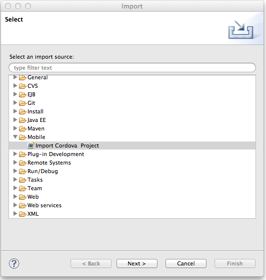
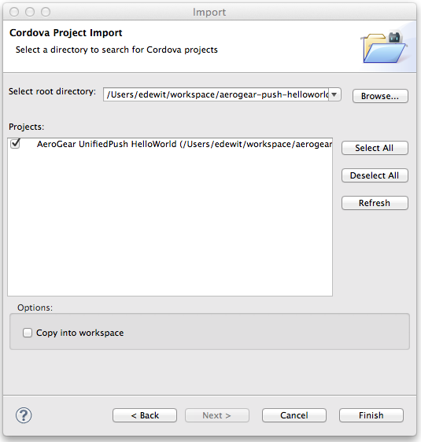
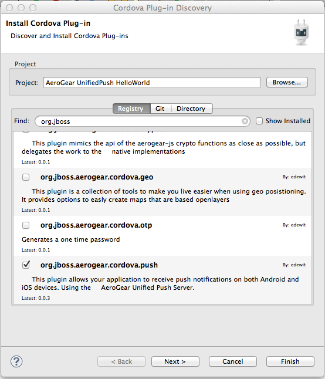
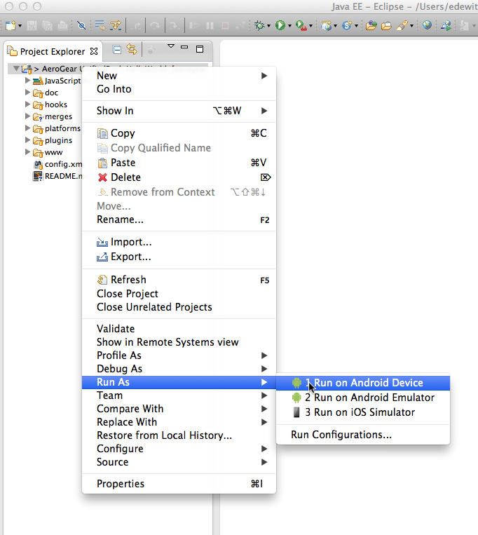

helloworld-push-cordova: Basic Mobile Application showing the AeroGear Push feature 
===================================================================================
Author: Erik Jan de Wit (edewit)
Level: Beginner  
Technologies: JavaScript cordova
Summary: A basic example of Push : Registration and receiving messages.  
Target Product: Mobile  
Product Versions: EAP 6.1, EAP 6.2, EAP 6.3  
Source: https://github.com/aerogear/aerogear-push-helloworld/cordova

What is it?
-----------

This project is a very simple helloworld, to show how to get started with cordova and the UnifiedPush Server

System requirements
-------------------

What is needed for Android / iOS / Cordova : think of Cordova version / xcode version / Android SDK version needed

install cordova
```
npm install -g cordova
```

To deploy on ios you need to install the ios-deploy package as well
```
npm install -g ios-deploy
```

Configure Cordova
-----------------

If you have not yet done so, you must [Configure Maven](../README.md#configure-maven) before testing the quickstarts.

Build and Deploy the HelloWorld
-------------------------------

## Change Push Configuration

In www/js/index.js find the pushConfig and change the server url to your openshift instance alias and variant/secret:

```javascript
var pushConfig = {
   pushServerURL: "<pushServerURL e.g http(s)//host:port/context >",
   android: {
      senderID: "<senderID e.g Google Project ID only for android>",
      variantID: "<variantID e.g. 1234456-234320>",
      variantSecret: "<variantSecret e.g. 1234456-234320>"
   },
   ios: {
      variantID: "<variantID e.g. 1234456-234320>",
      variantSecret: "<variantSecret e.g. 1234456-234320>"
   }
};

```

You can also copy/paste these settings from your UnifiedPush console

Install platforms
```
cordova platform add ios android
```

Add the plugin
```
cordova plugin add org.jboss.aerogear.cordova.push
```

### iOS
For iOS you'll need a valid provisioning profile as you will need to test on device (push notification not available on simulator)
Replace the bundleId with your bundleId (the one associated of your certificate), by editing the config.xml in the root of this project change the id attribute of the `widget` node. After that run a `cordova platform rm ios` followed by `cordova platform add ios` to change the xcode project template. 

Run the application on a device
```
cordova run <android or ios>
```

Application Flow
----------------------

## Registration
When you start the application Cordova will fire a `deviceready` event when Cordova initialization is done and the device is ready (see `www/js/index.js`). On this event the `register` function will be executed registering the device with the UnifiedPush server. The first argument is a function that gets executed when the device receives a push event, followed by a success and errorCallback that are invoked when the register was successful or not and the last parameter is the push configuration that indicates where the push server is located and wich varaint/secret to use. When registration is successful it will display this on the UI. You can also verify that the registration was successful by going to the console there a new instance will have appeared with your deviceId, platform and status.

## Sending message
Now you can send a message to your device by clicking `Compose Message...` from the application page. Write a message in the text field and hit 'Send Push Message'. 


After a while you will see the message end up on the device. In the register function we've specified a notification event handler `app.onNotification` this handler is invoked when a push notifcation is received and adds an item (li element) to the list. 


Run the HelloWorld in JBoss Developer Studio or Eclipse
-------------------------------------------------------

Import the generated project into JBDS


Select the project location and project


Add the plugin


Run the project on a device


Debug the Application
=====================

Start a browser chrome for android or safari for iOS

iOS 
* Develop -> <device name> -> index.html

Android
* Menu -> Tools -> Inspect Devices -> inspect
