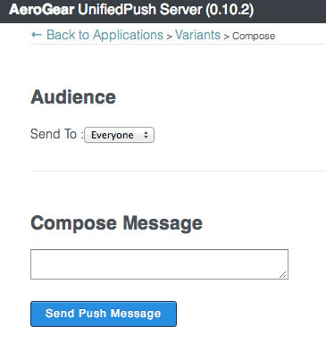

helloworld-push-ios: Basic Mobile Application showing the AeroGear Push feature on iOS
======================================================================================
Author: Corinne Krych (ckrych)  
Level: Beginner  
Technologies: Swift, iOS  
Summary: A basic example of Push : Registration and receiving messages.  
Target Product: Mobile  
Product Versions: MP 1.1
Source: https://github.com/aerogear/aerogear-push-helloworld/ios-swift

What is it?
-----------

This project is a very simple helloworld, to show how to get started with the UnifiedPush Server on iOS using Swift language. The Helloworld demo is implemented in Swift bu uses the Obejctive-C pub-lib framework.

System requirements
-------------------
- iOS 8.X
- Xcode version 6.0.beta4

Configure
---------
* Have created an variant in UnifiedPush admin console
* Have a valid provisioning profile as you will need to test on device (push notification not available on simulator)
* Replace the bundleId with your bundleId (the one associated with your certificate).
Go to HelloWorld target -> Info -> change Bundle Identifier field.


Open **HelloWorld.xcodeproj** and that's it.

Build and Deploy the HelloWorld
-------------------------------

### Change Push Configuration

In HelloWorld/AGAppDelegate.m find and replace URL, variant and secret:

```swift
    func application(application: UIApplication!, didRegisterForRemoteNotificationsWithDeviceToken deviceToken: NSData!) {
        NSLog("APN Success")
        let registration = AGDeviceRegistration(serverURL: NSURL(string: "<# URL of the running AeroGear UnifiedPush Server #>"))
        
        registration.registerWithClientInfo({ (clientInfo: AGClientDeviceInformation!) -> () in
            NSLog("UPS Register")
            clientInfo.deviceToken = deviceToken
            clientInfo.variantID = "<# Variant Id #>"
            clientInfo.variantSecret = "<# Variant Secret #>"
            
                // apply the token, to identify THIS device
                let currentDevice = UIDevice()
            
                // --optional config--
                // set some 'useful' hardware information params
                clientInfo.operatingSystem = currentDevice.systemName
                clientInfo.osVersion = currentDevice.systemVersion
                clientInfo.deviceType = currentDevice.model
            }, success: { () -> () in
                NSLog("UPS Success Register")
                // Send NSNotification for success_registered, will be handle by registered AGViewController
                let notification = NSNotification(name:"success_registered", object: nil)
                NSNotificationCenter.defaultCenter().postNotification(notification)
                
            }, failure: { (error:NSError!) -> () in
                NSLog("UPS Error Register")
                let notification = NSNotification(name:"error_registered", object: nil)
                NSNotificationCenter.defaultCenter().postNotification(notification)
            })
    }

```


Application Flow
----------------------

### Registration

When the application is launched, AGAppDelegate's ```application:didFinishLaunchingWithOptions:``` registers the app to receive remote notifications. 

Note that _registerForRemoteNotificationTypes:_ has been removed in iOS8 in favor of _registerUserNotificationSettings:_ and _registerForRemoteNotifications_

```swift
    func application(application: UIApplication, didFinishLaunchingWithOptions launchOptions: NSDictionary?) -> Bool {
        // Override point for customization after application launch.
        
        let settings = UIUserNotificationSettings(forTypes: .Alert | .Badge | .Sound, categories: nil)
        UIApplication.sharedApplication().registerUserNotificationSettings(settings)
        UIApplication.sharedApplication().registerForRemoteNotifications()
        ...
        return true
    }
```

Therefore, AGAppDelegate's ```application:didRegisterForRemoteNotificationsWithDeviceToken:``` will be called.

When AGAppDelegate's ```application:didRegisterForRemoteNotificationsWithDeviceToken:``` is called, the device is registered to UnifiedPush Server instance. This is where configuration changes are required (see code snippet below).

### Sending message
Now you can send a message to your device by clicking `Compose Message...` from the application page. Write a message in the text field and hit 'Send Push Message'. 



After a while you will see the message end up on the device. 

When the application is running in foreground, you can catch messages in AGAppDelegate's  ```application:didReceiveRemoteNotification:```. The event is forwarded using ```NSNotificationCenter``` for decoupling AGappDelegate and AGViewController. It will be the responsability of AGViewController's ```messageReceived:``` method to render the message on UITableView.

When the app is running in background, user can bring the app in the foreground by selecting the Push notification. Therefore AGAppDelegate's  ```application:didReceiveRemoteNotification:``` will be triggered and the message displayed on the list. If a background processing was needed we could have used ```application:didReceiveRemoteNotification:fetchCompletionHandler:```. Refer to [Apple documentation for more details](https://developer.apple.com/library/ios/documentation/uikit/reference/UIApplicationDelegate_Protocol/Reference/Reference.html#//apple_ref/occ/intfm/UIApplicationDelegate/application:didReceiveRemoteNotification:fetchCompletionHandler:)

For application not running, we're using AGAppDelegate's ```application:didFinishLaunchingWithOptions:```, we locally save the latest message and forward the event to AGViewController's ```messageReceived:```.

**NOTE**: The local save is required here because of the asynchronous nature of ```viewDidLoad``` vs ```application:didFinishLaunchingWithOptions:```


FAQ
--------------------

* Which iOS version is supported by AeroGear iOS libraries?

AeroGear supports iOS 7.X and 8.X


Debug the Application
=====================

Set a break point in Xcode.
