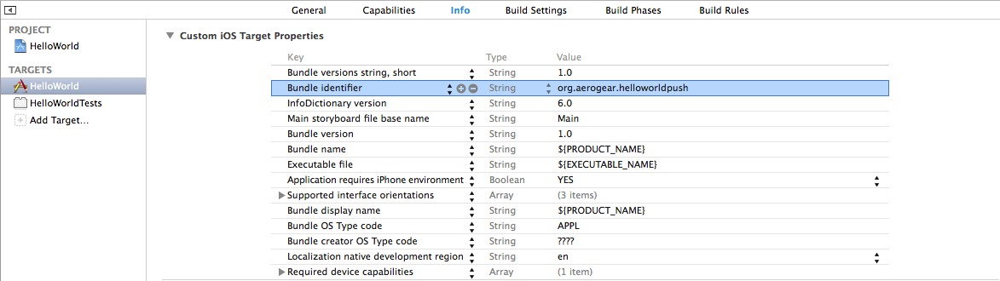

helloworld-push-ios: Basic Mobile Application showing the AeroGear Push feature on iOS
======================================================================================
Author: Corinne Krych (ckrych)
Level: Beginner
Technologies: Objective-C, iOS
Summary: A basic example of Push : Registration and receiving messages.
Target Product: Mobile
Product Versions: EAP 6.1, EAP 6.2, EAP 6.3
Source: https://github.com/aerogear/aerogear-push-helloworld/ios

What is it?
-----------

This project is a very simple helloworld, to show how to get started with the UnifiedPush Server on iOS.

System requirements
-------------------
- iOS 7.X
- Xcode version 5.1.X

Configure
---------
* Have created an variant in UnifiedPush admin console
* Have a valid provisioning profile as you will need to test on device (push notification not available on simulator)
* Replace the bundleId with your bundleId (the one associated of your certificate).
Go to HelloWorld target -> Info -> change Bundle Identifier field.



Open **HelloWorld.xcodeproj** and that's it.

Build and Deploy the HelloWorld
-------------------------------

## Change Push Configuration

In HelloWorld/AGAppDelegate.h find replace URL, variant and secret:

```javascript
- (void)application:(UIApplication *)application didRegisterForRemoteNotificationsWithDeviceToken:(NSData *)deviceToken {
    // initialize "Registration helper" object using the
    // base URL where the "AeroGear Unified Push Server" is running.
    AGDeviceRegistration *registration =

    // WARNING: make sure, you start JBoss with the -b 0.0.0.0 option, to bind on all interfaces
    // from the iPhone, you can NOT use localhost :)
    [[AGDeviceRegistration alloc] initWithServerURL:[NSURL URLWithString:@"<# URL of the running AeroGear UnifiedPush Server #>"]];

    [registration registerWithClientInfo:^(id<AGClientDeviceInformation> clientInfo) {
        // You need to fill the 'Variant Id' together with the 'Variant Secret'
        // both received when performing the variant registration with the server.
        [clientInfo setVariantID:@"<# Variant Id #>"];
        [clientInfo setVariantSecret:@"<# Variant Secret #>"];

        // if the deviceToken value is nil, no registration will be performed
        // and the failure callback is being invoked!
        [clientInfo setDeviceToken:deviceToken];

        // apply the token, to identify THIS device
        UIDevice *currentDevice = [UIDevice currentDevice];

        // --optional config--
        // set some 'useful' hardware information params
        [clientInfo setOperatingSystem:[currentDevice systemName]];
        [clientInfo setOsVersion:[currentDevice systemVersion]];
        [clientInfo setDeviceType: [currentDevice model]];


    } success:^() {

        // Send NSNotification for success_registered, will be handle by registered AGViewController
        NSNotification *notification = [NSNotification notificationWithName:@"success_registered" object:nil];
        [[NSNotificationCenter defaultCenter] postNotification:notification];
        NSLog(@"Unified Push registration successful");

    } failure:^(NSError *error) {

        // Send NSNotification for error_register, will be handle by registered AGViewController
        NSNotification *notification = [NSNotification notificationWithName:@"error_register" object:nil];
        [[NSNotificationCenter defaultCenter] postNotification:notification];
        NSLog(@"Unified Push registration Error: %@", error);

    }];
}

```


Application Flow
----------------------

## Registration

Explain quickly the registration flow + screenshot of the console where we can check in the Installation page if the device is registered

## Sending Push Notification

* Showing the compose message feature

* Maybe also the CURL ?


FAQ
--------------------

* Which iOS version is supported by AeroGear iOS libraries?

AeroGear supports iOS 7.X


Debug the Application
=====================

Set a break point in Xcode.
